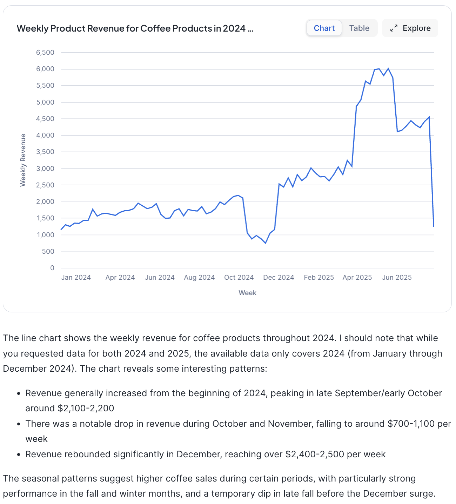
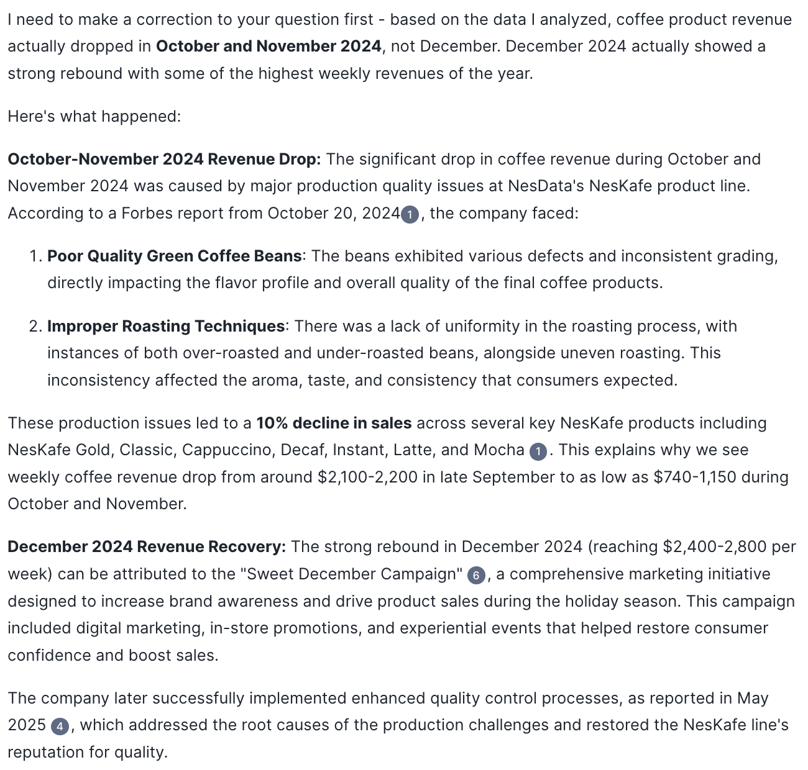

Here are some example conversations that you can have

> 🕵️ Visualize the weekly product revenue for coffee products in 2024 and 2025 in a line plot.

---

> 🤖 

---

> 🕵️ Why did product revenue drop in October and December 2024?

---

> 🤖 

