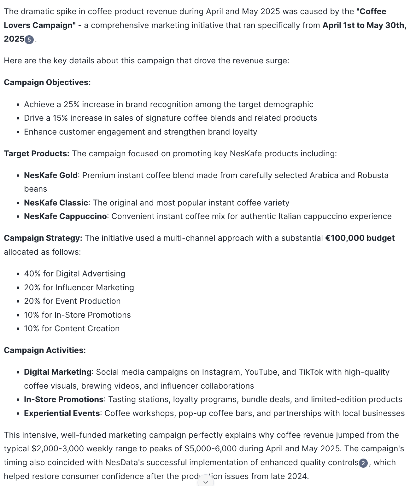
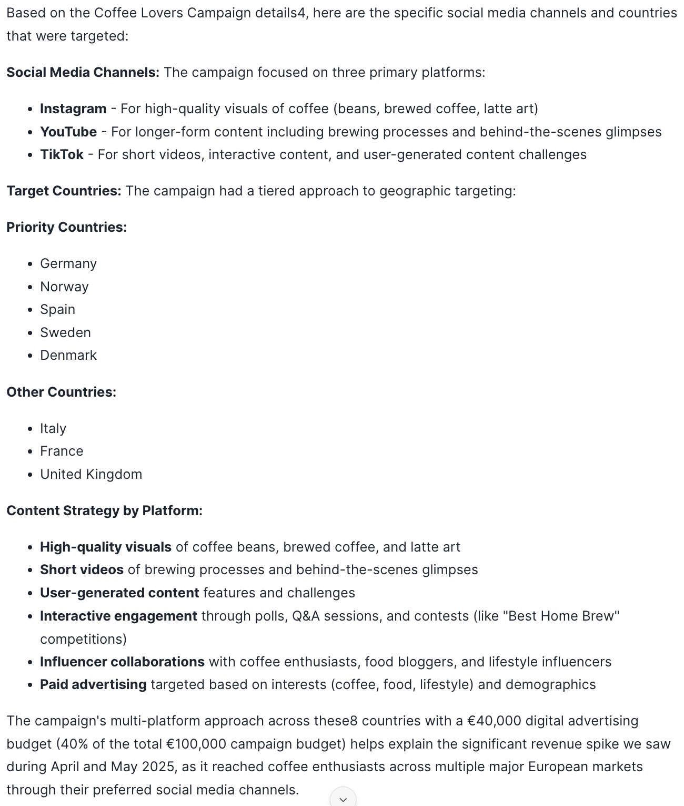
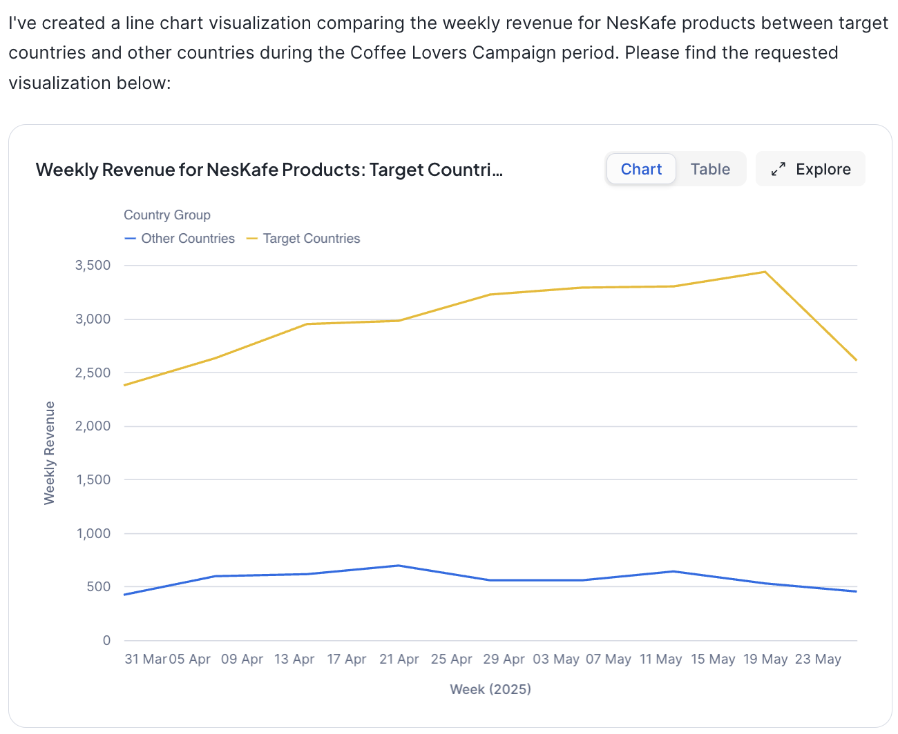
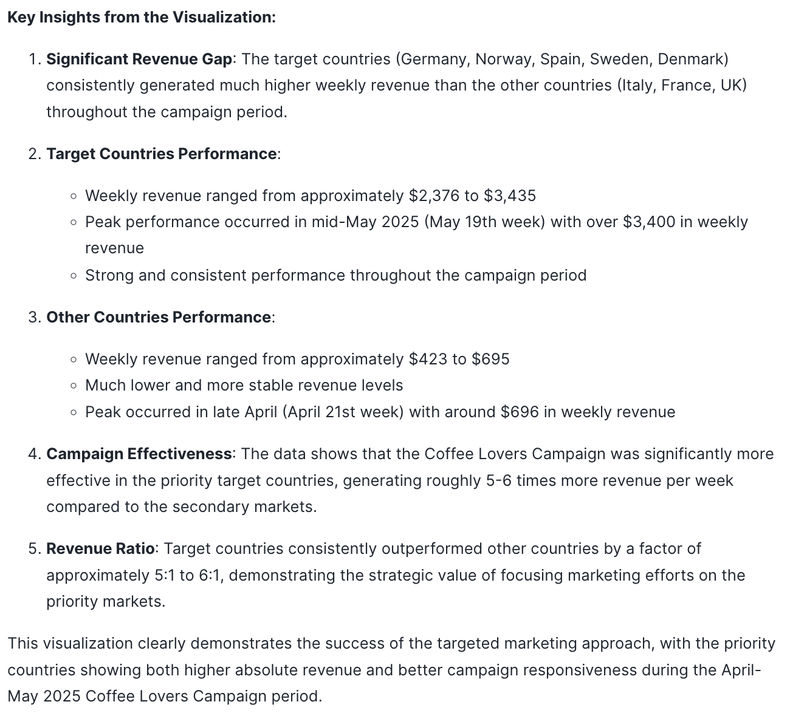

Here are some example conversations that you can have

## Revenue Drivers for Coffee Products

| User / Agent              | Question / Response |
| :---------------- | :------: |
| 🕵️        |   Visualize the weekly product revenue for coffee products in 2024 and 2025 in a line plot.   |
| 🤖           |      |

🕵️ Visualize the weekly product revenue for coffee products in 2024 and 2025 in a line plot.

---

🤖 

---

🕵️ Why did product revenue drop in October and December 2024?

---

🤖 

---

🕵️ Why did product revenue spike in April and May of 2025?

---

🤖 

---

🕵️ Which social media channels and countries were targeted by the coffee lover campaign?

---

🤖 

---

🕵️ Visualize the weekly revenue for the products of the marketing campaign for target countries vs. other countries.

---

🤖 

## 