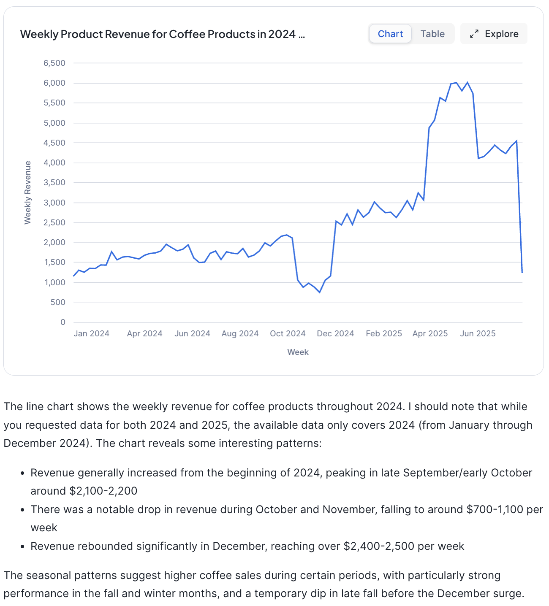
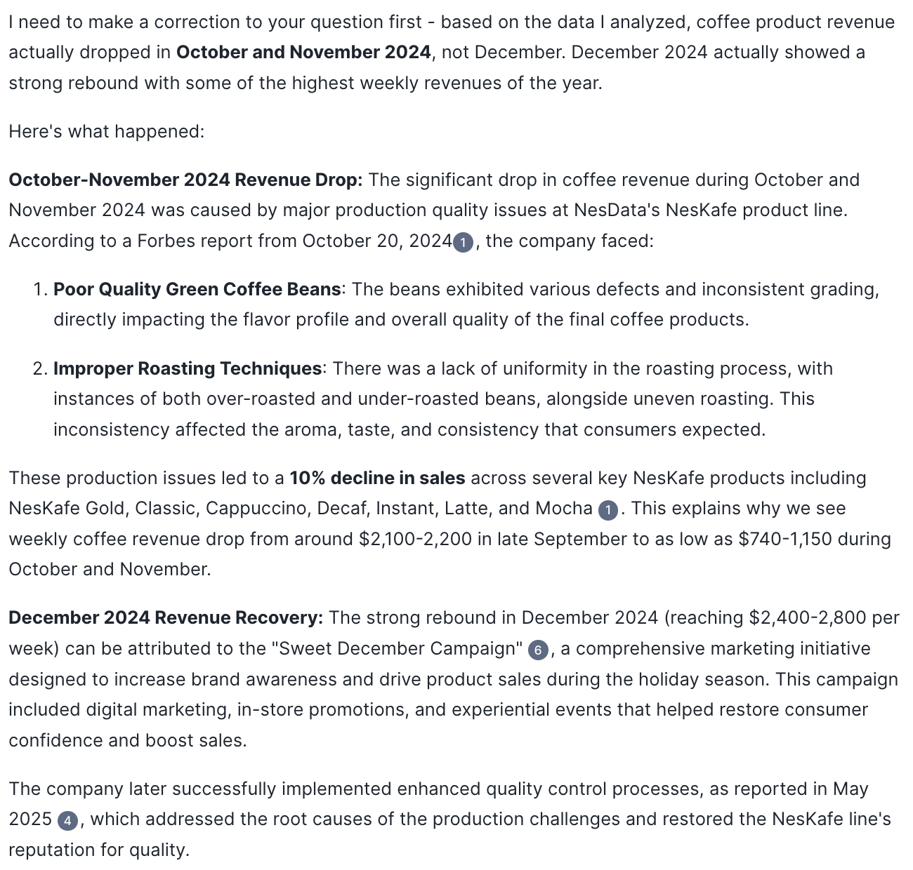
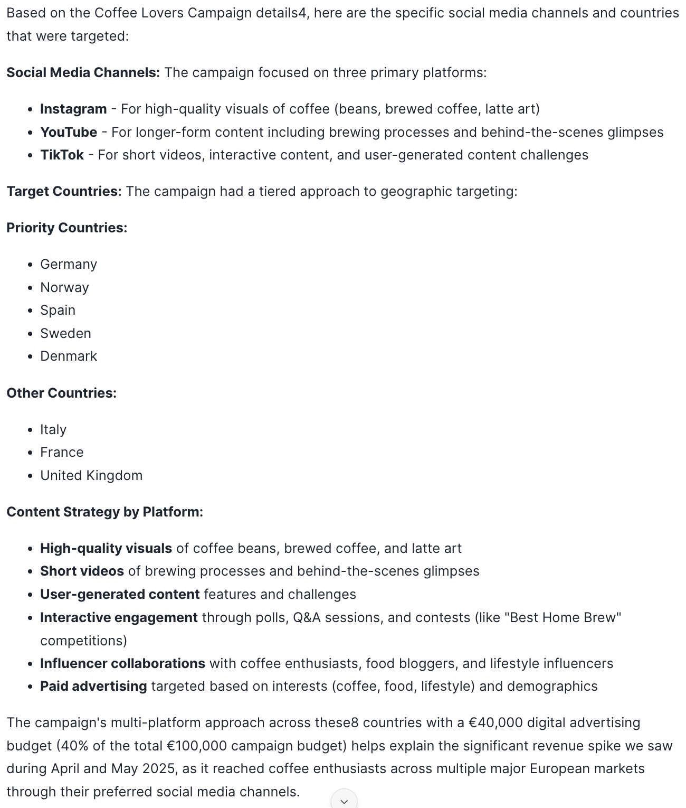
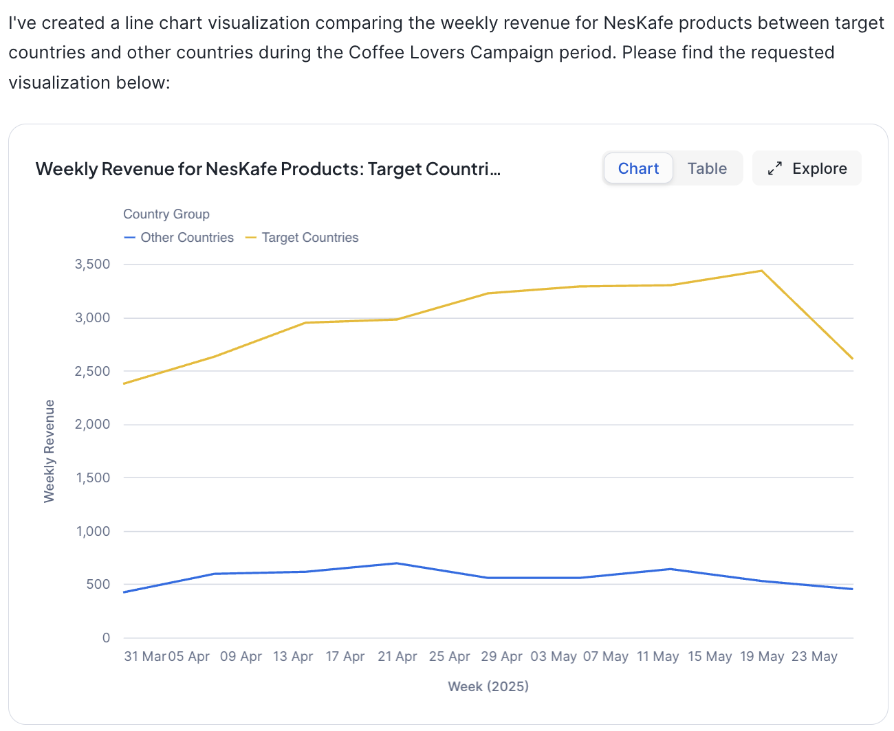
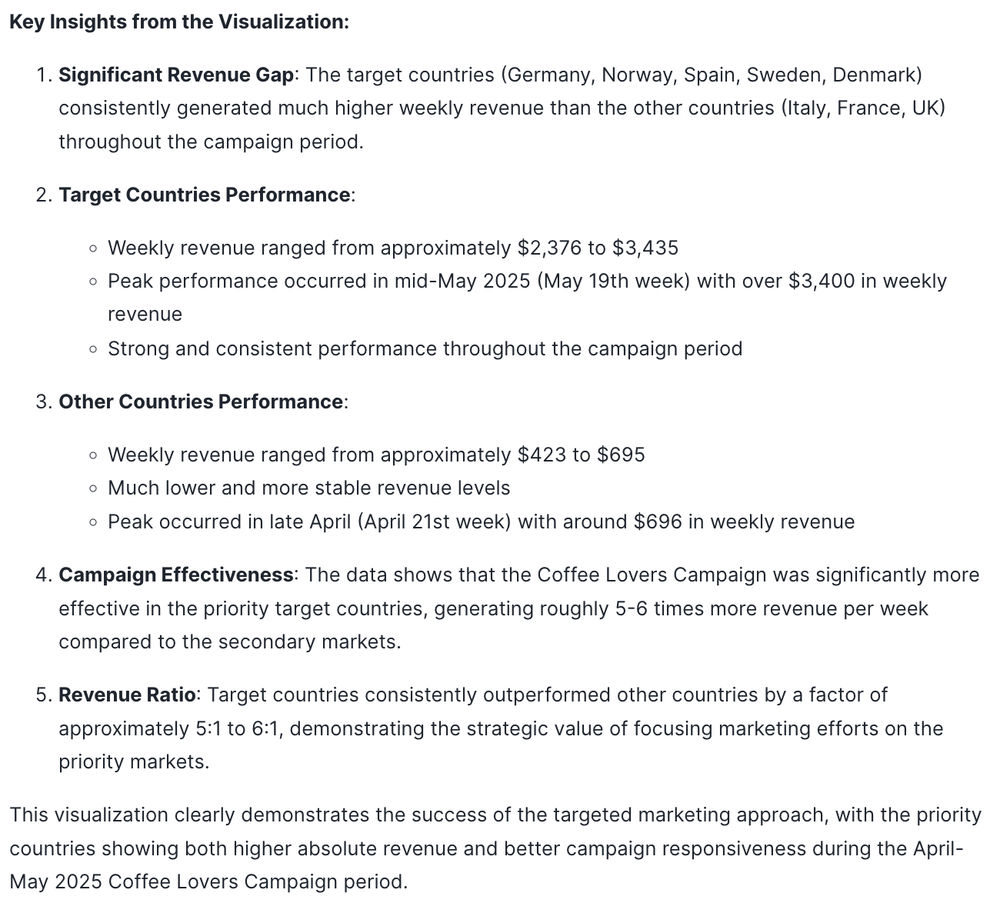
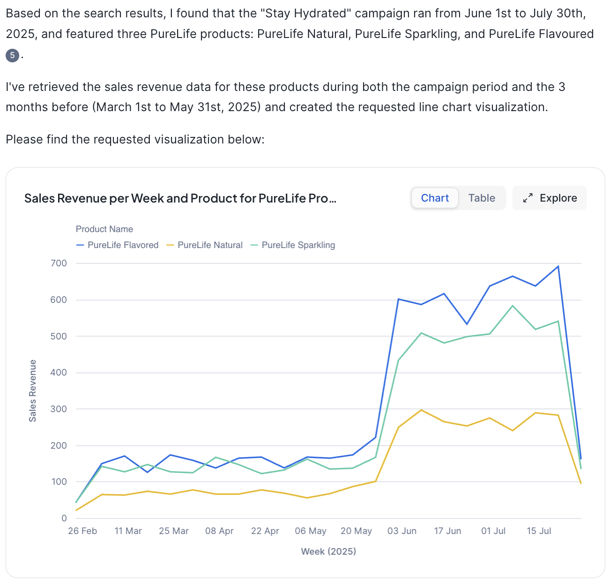
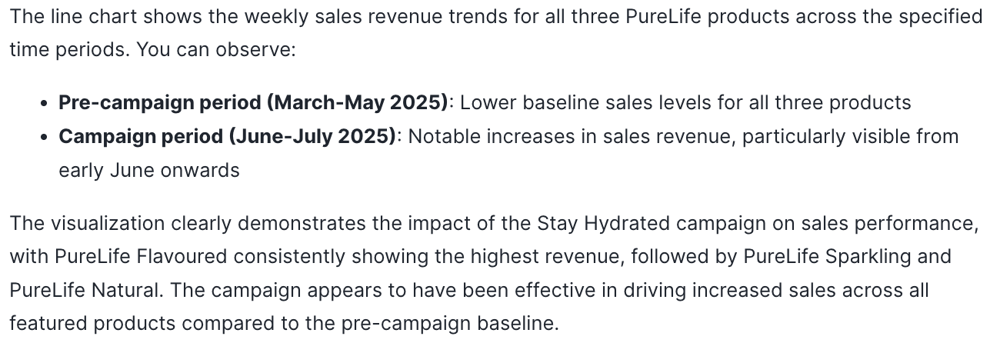

Here are some example conversations that you can have

## Revenue Drivers for Coffee Products

| User / Agent              | Question / Response |
| :---------------- | :------ |
| 🕵️        |   Visualize the weekly product revenue for coffee products in 2024 and 2025 in a line plot.   |
| 🤖           |      |
| 🕵️        |   Why did product revenue drop in October and December 2024?   |
| 🤖           |   |
| 🕵️        |   Why did product revenue spike in April and May of 2025?   |
| 🤖           |      |
| 🕵️        |   Which social media channels and countries were targeted by the coffee lover campaign?   |
| 🤖           |      |
| 🕵️        |   Visualize the weekly revenue for the products of the marketing campaign for target countries vs. other countries.   |
| 🤖           |      |

## Analyzing the Stay Hydrated Marketing Campaign
| User / Agent              | Question / Response |
| :---------------- | :------ |
| 🕵️        |  Visualize the sales revenue per week and product for products featured in the stay hydrated campaign during the campaign period and the 3 months before the campaign. Use a line chart.   |
| 🤖           |       |

