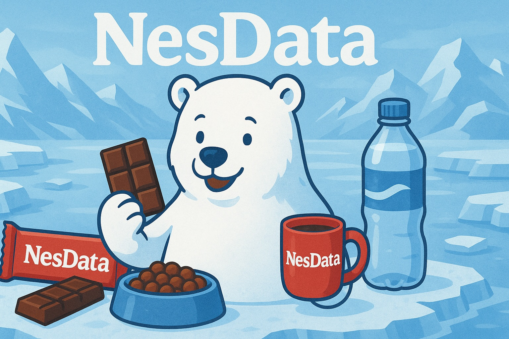

# NesData



## Overview
**NesData** is a global food and beverage company that creates products for everyday moments and special occasions. From chocolate and coffee to bottled water, frozen meals, and pet nutrition, NesData offers a diverse portfolio of trusted brands found in kitchens and pantries worldwide. Operating in over 180 countries, we combine quality ingredients with innovative food science to deliver taste, nutrition, and convenience. With a commitment to sustainable sourcing and responsible manufacturing, NesData helps families enjoy better food while supporting communities and environmental stewardship around the globe.

## Use Case Deployment
Execute this SQL Query to create and run the notebook in your account which will generate data and required services.
```sql
EXECUTE IMMEDIATE FROM @CORTEX_AGENTS_DEMO.PUBLIC.GITHUB_REPO_CORTEX_AGENTS_DEMO/branches/main/use_cases/nesdata/_internal/setup.sql
  USING (BRANCH => 'main', EXECUTE_NOTEBOOKS => TRUE) DRY_RUN = FALSE;
```

> [!IMPORTANT]
> This demo expects that you have access to Snowflake Intelligence.

## Structured Data & Unstructured Data
This repository contains a **fictional financial dataset** from _NesData_. 

In addition to that we also have unstructured data for marketing campaigns, customer contracts, financial reports and product specifications.

## Example Questions
### Selected Services:
These questions are meant to be used in Snowflake Intelligence since they require complex planning, multi-tool use and graph generation.

### **Questions for Structured Data**
These queries operate on structured, tabular data sources.

| Question | Query Complexity |
|----------|---------|
| What was the total revenue for 2023? | 🟢 **Easy** |
| What's the average unit price of Chocolate products? | 🟢 **Easy** |
| What was the monthly revenue for nescafe classic and gold in 2023? Visualize revenue per product per month in a line chart. | 🟡 **Medium** |
| What are the top 5 best-selling products by quantity? | 🟡 **Medium** |
| Which customer type generates the highest gross profit? | 🟡 **Medium** |
| What's the profit margin by product category? | 🟡 **Medium** |
| Show regional performance for Q1 2023. | 🟡 **Medium** |
| Visualize revenue per month and region in a line chart. | 🟡 **Medium** |
| Visualize the monthly revenue in 2023 for customer freshmart central as a line plot. | 🔴 **Hard** |
| Which products had sales growth above 20% comparing Q4 2023 vs Q4 2022? | 🔴 **Hard** |
| What's the impact of marketing campaigns on sales performance? Compare sales with and without marketing campaigns using our sales data. | 🔴 **Hard** |
| Find customers who buy products from at least 4 different categories and rank them by total spend. | 🔴 **Hard** |
| Calculate the 3-month rolling average revenue for each product category. | 🔴 **Hard** |
| Identify seasonal patterns: which products peak in which quarters across all years? | 🔴 **Hard** |

### **Questions requiring Structured + Unstructured Data**  
These queries analyze text-based documents.

| Question | Query Complexity |
|----------|---------|
| What was the budget for the Coffee Lovers campaign and what were the actual coffee sales during that period? | 🔴 **Hard** |
| Which products were featured in the Summer Hydration campaign and how did their individual sales perform during the campaign? Visualize sales in a line plot. | 🔴 **Hard** |
| Analyze the Holiday Treats campaign's claim of $5.2M incremental revenue against actual chocolate sales data. | 🔴 **Hard** |
| Compare our reported coffee category performance with actual sales transactions in 2023. | 🔴 **Hard** |
| What were our regional revenue figures for 2023 from our sales data and how do they compare to our regional reports from 2023? | 🔴 **Hard** |
| Compare premium vs. standard product performance - which NesKafe products have higher margins and what differentiates them? | 🔴 **Hard** |